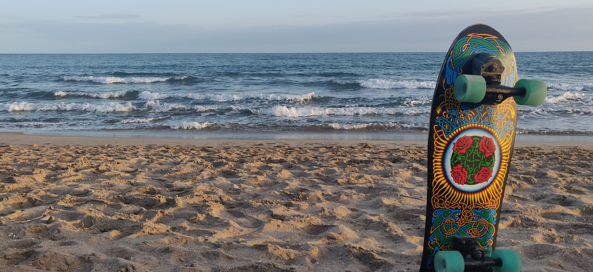

<!--
### Hi there 👋

**asqwerty666/asqwerty666** is a ✨ _special_ ✨ repository because its `README.md` (this file) appears on your GitHub profile.

Here are some ideas to get you started:

- 🔭 I’m currently working on ...
- 🌱 I’m currently learning ...
- 👯 I’m looking to collaborate on ...
- 🤔 I’m looking for help with ...
- 💬 Ask me about ...
- 📫 How to reach me: ...
- 😄 Pronouns: ...
- ⚡ Fun fact: ...
-->

### This is how I'm increasing entropy nowadays 🤪

---

I have a Phd in Physics and a strong background in complex systems and medical physics. I have working as a scholar but also in the private sector. I have strong experience developing practical tools in more than a dozens of programming languages. For the time being I work as a freelancer, mostly developing pipelines for Neuroimaging and Bioinformatics analysis in a HPC environment. Mainly a problem solver, I can do statistics with R, develop a parser with Perl or write a Python script to parallelise a data analysis.

I am the Neuroimaging and HPC manager for ACE Alzheimer Center Barcelona. I have implemented some innovative approaches related to dementia research. I develop and maintain a customized neuroimaging pipeline for ACE, focused on the automatization of tasks over a SLURM cluster. I mantain the XNAT platform for ACE neuroimaging as well as a bash client for interacting with XNAT. I also provide advice for parallelization of scientific applications into the HPC cluster. I maintain some public and private repositories where I develop software intended to work into parallelization environments.

Rigth now I'm looking into colaborations on HPC and bioinformatics. I'm active searching for some project were I can apply my abilities in process parallelization as well as my knowledge of linux scripting.    

