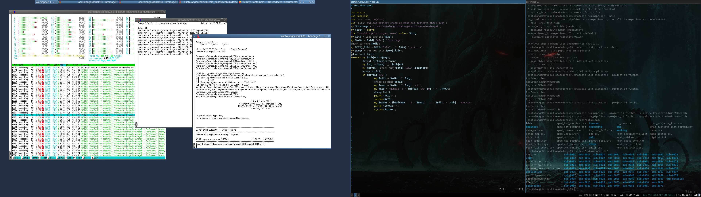

<!--
### Hi there 👋


**asqwerty666/asqwerty666** is a ✨ _special_ ✨ repository because its `README.md` (this file) appears on your GitHub profile.

Here are some ideas to get you started:

- 🔭 I’m currently working on ...
- 🌱 I’m currently learning ...
- 👯 I’m looking to collaborate on ...
- 🤔 I’m looking for help with ...
- 💬 Ask me about ...
- 📫 How to reach me: ...
- 😄 Pronouns: ...
- ⚡ Fun fact: ...
-->

### This is how I'm increasing entropy  🤪


---

- *20221108*

I need to storage some external data into XNAT. It seems the proper way for me is to put the data as aditional resource per experiment. So basically I should build two functions. First one just to put a json as a resource. This is straightforward, I just ask for the host, jsession, project, experiment an a location to put the json. 

```
sub xput_res {
        my @xdata = @_;
        my $crd = 'curl -f -X PUT -b JSESSIONID='.$xdata[1].' "'.$xdata[0].'/data/experiments/'.$xdata[2].'/resources/'.$xdata[3].'/files/'.$xdata[4].'?overwrite=true" -F file="@'.$xdata[5].'"';
        system($crd);
}
```

But now I want to be able to retrieve the data. That is, I want to tell the *get* function where the right json file is and I want to get a simple hash. If I now what I'm looking for then it should be easy to amnage the info later. Maybe if this is managed as a single resource array, it should be easier,


```
sub xget_res {
        my @xdata = @_;
        my $crd = 'curl -f -X GET -b JSESSIONID='.$xdata[1].' "'.$xdata[0].'/data/experiments/'.$xdata[2].'/resources/'.$xdata[3].'/files/'.$xdata[4].'" 2>/dev/null';
        my $json_res = qx/$crd/;
        my %out_data;
        my $data_prop = decode_json $json_res;
        foreach my $data_res (@{$data_prop->{'ResultSet'}{'Result'}}){
                foreach my $kdata (sort keys %{$data_res}){
                        $out_data{$kdata} = ${$data_res}{$kdata};
                }
        }
        return %out_data;
}


```
So far so good, those functions should be enough for the time being.

---

- *20221028*

Thinking about how to manage right the H2H project into the cluster

---

- *20221027*

Testing MC for PET-Tau *before* registration to MRI space. SNR really improves.

Choosing FS registration over ANTs seems to be faster without lost of quality. It is simpler, also.

---

- *20221009*

Fixing registration for PET-Tau over MRI with ANTS has proved to be harder than expected. I took a tour over all the metrics and options of *antsRegitration* script and there is no one size fit all option. I managed to do the job but still I'm no happy with the final method. Still the results are OK. 

---

 - *20220815*

A few months with lot of dirty work to do. 

---

 - *20220413*

Messing with XNAT these days. Learning the best way to use the experiment and subject API to store non image data. Visual reading reports and associated variables as experiment resources, custom subject variables and even pdf files with project acquisition protocols. XNAT proves to be very useful after some reading hours.

---

 - *20220401*

Lot of fun rewriting [xnatapic](https://github.com/asqwerty666/xnatapic) for reusing JSESSION ID.

---

 - *20220331*

I was having a lot of trouble with XNAT and my scripts. But last nigth I found this: [Generating and Reusing a JSESSION ID for Scripted Interactions](https://wiki.xnat.org/documentation/how-to-use-xnat/generating-and-reusing-a-jsession-id-for-scripted-interactions) and it seems to me that half of my problems with tomcat are solved. :godmode: 

---

 - *20220319*
 
 Quiet days. Doing some inavoidable repetitive tasks. The bad of semiautomatic is always that the semi part is quite large. Visual evaluation, manual checking and some other boring tasks.
 
---

 - *20220316*

I put an array into a hash, so I was dropping half of data. I needed to review the libraries looking for the output of functions. Yes it's painful but you need to doc all your functions. I don't have enough time to maintain everything properly 😢. Anyway, dumb errors are inescapable. But sometimes when everything is in place hard things could become easy. 

This days the hard work from past years are making things easier. 😄



---

 - *20220315*
 
Doing some strange work with matlab. I have been commissioned to run [brainageR](https://github.com/james-cole/brainageR) on the HPC cluster. But no way. It depends on Matlab and I have no network licences 🌩️. So, the software runs OK but there is no way of using the SPM runtime or any container. Too bad I need to run this serial 😠. So, at least 10 days of calculations if everything is fine. 👊 

---

 - *20220309*
 
 SSDD
 
 - Studying some hierarchical clustering algorithms for improving things. Actually boring.
 - Exporting FS results in all devisable format
 
 
 
---

 - *20220216*

Working on longitudinal analysis. Figuring out a lot of things not done yet. 🤯

---

 - *20220211*
 
Shitty parser finished ☺️
 
---

 - *20220210*

I should send some data in SPSS format. So, let's do some dirty tricks inside my Perl scripts to export the data through an R library. 

```
		my $rscript = mktemp($tmp_dir.'/rtmpscript.XXXXX');
		open ORS, ">$rscript";
		print ORS 'library("haven")'."\n";
		print ORS 'setwd("'.$odir.'")'."\n";
		print ORS 'read.csv("'.$tmpf.'") -> w'."\n";
		print ORS 'write_sav(w,"'.$savfile.'")'."\n";
		close ORS;
		print "$rscript\n";
		system("Rscript $rscript");
```

---

 - *20220209*

Writing another parser. 💩. Some people think that improving a report means to change the format each month. 🤦

Quiet night. 
Testing rpi3 as NFS server for backing up SDCards. Well, the SD Cards ussually get out of order and fixing again all the custom settings is boring. So, I will backup the card images in a home made NFS server an eventually I just will need to pull them into a new card. I hope.

---
 - *20220202*

Dealing with a lot of data. Very slow anonimization and uploading proccesses 🤮 

Thanks to [barrier project](https://github.com/debauchee/barrier) my work is a lot more easy these days

---
- *20220128*

Actually the WMH calculus works just fine. Doing some testing on real data. 😃 


---

 - *20220127*

Working on WMH pipeline implementation with [PGS](https://wmh.isi.uu.nl/results/pgs/)

---
 - *20220125*

Lot of work: 

- Reviewing papers 😕
- Fixing PET-tau pipeline 🥴
- Writing new imaging processing procedure 🙃
- Making a new beamer presentation about SLURM and programatic tasks 🤠 


---
 - *20220115*

*slurm-modpy* released 🙂

First version including a simple example. Lot of fun.

---
 - *20220114*

Working on a slurm related project. I'm doing a helper to launch sbatch jobs inside python scripts. Actually the helper writing was fun but the docs are doble large and half fun. :persevere: 

Whisky helps at nighty work, anyways

---
  - *20220104*

Updating neurodegeneration assessment implementation

---
  - *20211220*

New MRI protocol implemented. 👍 Mostly based on *dcm3tools* and using *xnatapic* for and easy managment.  
 
---
  - *20211216*

I'm currently working on new implementations of working methods for DTI and looking for how to integrate them on XNAT. 🤦

---
 - *20211020*
 
 Working in the integration of my pipeline with XNAT. Interaction is easy but the QC management is driving me crazy
