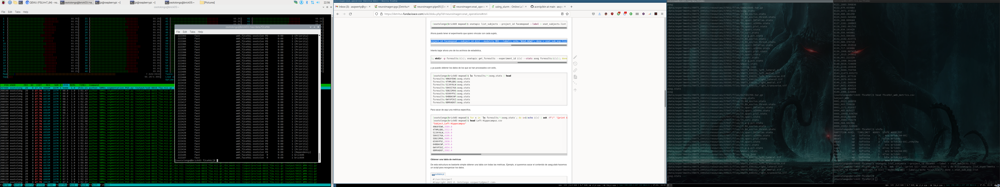
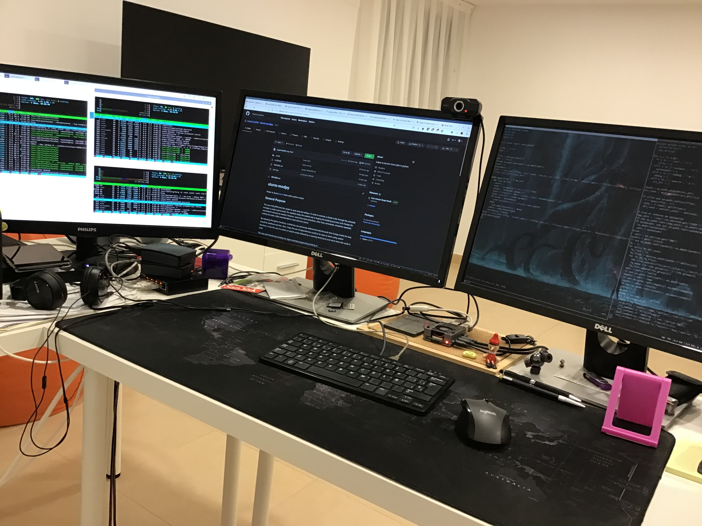

<!--
### Hi there 👋


**asqwerty666/asqwerty666** is a ✨ _special_ ✨ repository because its `README.md` (this file) appears on your GitHub profile.

Here are some ideas to get you started:

- 🔭 I’m currently working on ...
- 🌱 I’m currently learning ...
- 👯 I’m looking to collaborate on ...
- 🤔 I’m looking for help with ...
- 💬 Ask me about ...
- 📫 How to reach me: ...
- 😄 Pronouns: ...
- ⚡ Fun fact: ...
-->

### This is how I'm increasing entropy  🤪


---

 - *20220216*

Working on longitudinal analysis. Figuring out a lot of things not done yet. 🤯

---

 - *20220211*
 
Shitty parser finished ☺️
 
---

 - *20220210*

I should send some data in SPSS format. So, let's do some dirty tricks inside my Perl scripts to export the data through an R library. 

```
		my $rscript = mktemp($tmp_dir.'/rtmpscript.XXXXX');
		open ORS, ">$rscript";
		print ORS 'library("haven")'."\n";
		print ORS 'setwd("'.$odir.'")'."\n";
		print ORS 'read.csv("'.$tmpf.'") -> w'."\n";
		print ORS 'write_sav(w,"'.$savfile.'")'."\n";
		close ORS;
		print "$rscript\n";
		system("Rscript $rscript");
```

---

 - *20220209*

Writing another parser. 💩. Some people think that improving a report means to change the format each month. 🤦

Quiet night. 
Testing rpi3 as NFS server for backing up SDCards. Well, the SD Cards ussually get out of order and fixing again all the custom settings is boring. So, I will backup the card images in a home made NFS server an eventually I just will need to pull them into a new card. I hope.

---
 - *20220202*

Dealing with a lot of data. Very slow anonimization and uploading proccesses 🤮 

Thanks to [barrier project](https://github.com/debauchee/barrier) my work is a lot more easy these days

---
- *20220128*

Actually the WMH calculus works just fine. Doing some testing on real data. 😃 



---

 - *20220127*

Working on WMH pipeline implementation with [PGS](https://wmh.isi.uu.nl/results/pgs/)

---
 - *20220125*

Lot of work: 

- Reviewing papers 😕
- Fixing PET-tau pipeline 🥴
- Writing new imaging processing procedure 🙃
- Making a new beamer presentation about SLURM and programatic tasks 🤠 



---
 - *20220115*

*slurm-modpy* released 🙂

First version including a simple example. Lot of fun.

---
 - *20220114*

Working on a slurm related project. I'm doing a helper to launch sbatch jobs inside python scripts. Actually the helper writing was fun but the docs are doble large and half fun. :persevere: 

Whisky helps at nighty work, anyways

---
  - *20220104*

Updating neurodegeneration assessment implementation

---
  - *20211220*

New MRI protocol implemented. 👍 Mostly based on *dcm3tools* and using *xnatapic* for and easy managment.  
 
---
  - *20211216*

I'm currently working on new implementations of working methods for DTI and looking for how to integrate them on XNAT. 🤦

---
 - *20211020*
 
 Working in the integration of my pipeline with XNAT. Interaction is easy but the QC management is driving me crazy
