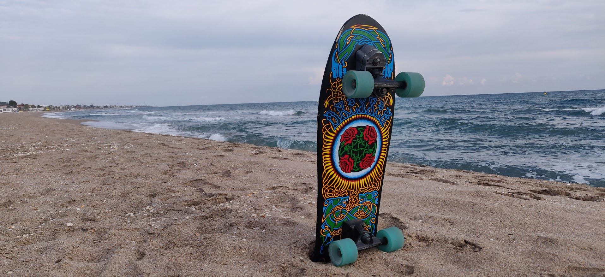

<!--
### Hi there 👋

**asqwerty666/asqwerty666** is a ✨ _special_ ✨ repository because its `README.md` (this file) appears on your GitHub profile.

Here are some ideas to get you started:

- 🔭 I’m currently working on ...
- 🌱 I’m currently learning ...
- 👯 I’m looking to collaborate on ...
- 🤔 I’m looking for help with ...
- 💬 Ask me about ...
- 📫 How to reach me: ...
- 😄 Pronouns: ...
- ⚡ Fun fact: ...
-->

### This is how I'm increasing entropy  🤪

 
 - *20220125*

Lot of work:
- Reviewing papers 😕
- Fixing PET-tau pipeline 🥴
- Writing new imaging processing procedure 🙃
- Making a new beamer presentation about SLURM and programatic tasks 🤠

---
 - *20220115*

*slurm-modpy* released 🙂

First version including a simple example. Lot of fun.

---
 - *20220114*

Working on a slurm related project. I'm doing a helper to launch sbatch jobs inside python scripts. Actually the helper writing was fun but the docs are doble large and half fun. :persevere: 

Whisky helps at nighty work, anyways

---
  - *20220104*

Updating neurodegeneration assessment implementation

---
  - *20211220*

New MRI protocol implemented. 👍 Mostly based on *dcm3tools* and using *xnatapic* for and easy managment.  
 
---
  - *20211216*

I'm currently working on new implementations of working methods for DTI and looking for how to integrate them on XNAT. 🤦

---
 - *20211020*
 
 Working in the integration of my pipeline with XNAT. Interaction is easy but the QC management is driving me crazy
